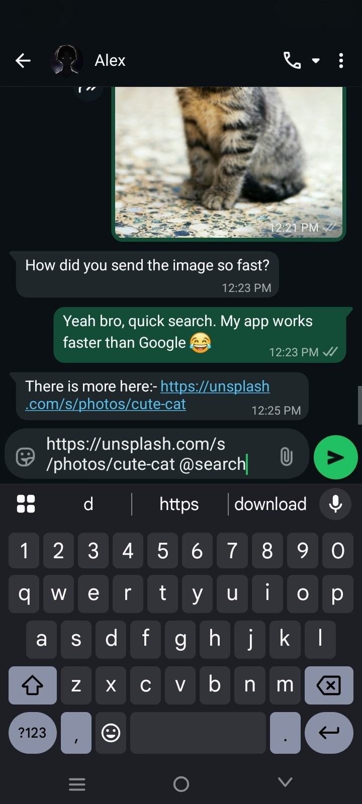

<div align="center">

# 🧠 AIDO - AI, Do It Once

### *Type Once get it right with Aido*

[](https://github.com/rehan5039/aido)
[](https://developer.android.com)
[](https://kotlinlang.org)

</div>

---

## 🎯 What is AIDO?

**AIDO** (AI, Do It Once) is a revolutionary AI-powered Android keyboard that transforms the way you type. It's not just a keyboard it's your intelligent writing assistant that works seamlessly across **every app** on your device. Simply type your text, add a trigger like `@fixg` or `@summ`, and watch AI instantly enhance, rewrite, or transform your content.

**Example:**
```
Type: "This text have grammer mistakes@fixg"
Result: "This text has grammar mistakes"
```

---

## Screenshots

<div align="center">

### App Interface

<table>
  <tr>
    <td></td>
    <td></td>
    <td></td>
    <td></td>
  </tr>
  <tr>
    <td></td>
    <td></td>
    <td></td>
    <td></td>
  </tr>
</table>

</div>

---

## Getting Started

### 1. Setup Gemini API Key

AIDO requires a Google Gemini API key for AI features.

#### Get Your API Key
1. Visit [Google AI Studio](https://aistudio.google.com)
2. Sign in with your Google account
3. Click **"Get API key"** in the left sidebar
4. Click **"Create API key in new project"** or select an existing project
5. Copy the generated API key

#### Add API Key to AIDO
1. Open **AIDO** app
2. Navigate to **Settings** ⚙️
3. Scroll to **"AI Provider Settings"**
4. Paste your API key in the **"Gemini API Key"** field
5. Select your preferred model (e.g., `gemini-1.5-pro`)
6. Tap **"Test and Save API Key"**
7. Wait for the success confirmation ✅

### 2. Enable AIDO Keyboard

#### Activate Accessibility Service
1. Open AIDO app
2. Tap **"Grant Accessibility Permission"** button on Home screen
3. Find **"Aido"** in the accessibility services list
4. Toggle it **ON**
5. Confirm the permission dialog

#### Set AIDO as Default Keyboard
1. Go to Android **Settings** > **System** > **Languages & input** > **Virtual keyboard**
2. Tap **"Manage keyboards"**
3. Enable **"Aido Keyboard"**
4. In any text field, long-press the spacebar or tap the keyboard icon
5. Select **"Aido Keyboard"**

### 3. Start Using AIDO

That's it! Now type in any app and use triggers to activate AI features.

---

## 🎯 Built-in Commands

AIDO comes with 12 powerful pre-configured commands:

| Trigger | Command | Description | Example Use Case |
|---------|---------|-------------|------------------|
| `@aido` | **Answer** | Get intelligent answers to questions | "What is quantum computing@aido" |
| `@fixg` | **Fix Grammar** | Fix grammar, spelling, and punctuation | "This are wrong@fixg" |
| `@summ` | **Summarize** | Condense text into 1-2 sentences | "Long article text...@summ" |
| `@polite` | **Make Polite** | Rewrite in polite, professional tone | "I need this now@polite" |
| `@casual` | **Make Casual** | Rewrite in friendly, relaxed tone | "I would like to inquire@casual" |
| `@expand` | **Expand** | Add more detail and elaboration | "Good idea@expand" |
| `@bullet` | **Bullets** | Convert to clear bullet points | "List benefits of exercise@bullet" |
| `@improve` | **Improve** | Enhance writing quality and clarity | "Make this better@improve" |
| `@rephrase` | **Rephrase** | Say the same thing differently | "Change this wording@rephrase" |
| `@emoji` | **Add Emojis** | Add relevant emojis to text | "Happy birthday@emoji" |
| `@formal` | **Make Formal** | Rewrite in formal business tone | "Hey, got your email@formal" |
| `@funny` | **Make Funny** | Add humor to text | "Meeting at 3pm@funny" |

### 🔮 Special Commands

| Trigger | Feature | Description |
|---------|---------|-------------|
| `@reply` | **Smart Reply** | Get context-aware reply suggestions (maintains conversation language) |
| `@tone` | **Tone Rewrite** | Dynamically adjust tone with multiple suggestions |
| `@all` | **Command Browser** | View all available commands in a scrollable popup |


---

## 💡 Usage Examples

### Example 1: Fix Grammar
```
Input:  "i have went to store yesterday and buy some apple@fixg"
Output: "I went to the store yesterday and bought some apples"
```

### Example 2: Get Answer
```
Input:  "Explain photosynthesis in simple terms@aido"
Output: "Photosynthesis is the process by which plants use sunlight, 
         water, and carbon dioxide to produce oxygen and energy in 
         the form of glucose."
```

### Example 3: Make Polite
```
Input:  "Send me the report now@polite"
Output: "Would you kindly send me the report at your earliest convenience?"
```


---

## ⚙️ Configuration

### AI Provider Settings

#### Gemini API Configuration
- **API Key**: Your Google Gemini API key
- **Model Selection**: Choose from available models
  - `gemini-1.5-pro` - Most capable, best for complex tasks
  - `gemini-1.5-flash` - Faster, optimized for speed
  - `gemini-pro` - Balanced performance
- **Temperature**: Control creativity (0.0 = precise, 1.0 = creative)
- **Max Tokens**: Set response length limit

#### Offline Mode
Enable offline mode to:
- Prevent API calls when privacy is critical
- Save API quota
- Work without internet connection
- Note: AI features will be disabled, but keyboard functions remain active

### Keyboard Settings

- **Theme Selection**: Choose from multiple keyboard themes
- **Key Vibration**: Enable/disable haptic feedback
- **Sound Effects**: Toggle key press sounds
- **Auto-Capitalization**: Smart capitalization
- **Auto-Correction**: Built-in spell check
- **Gesture Typing**: Swipe to type (coming soon)

### Accessibility Settings

- **Enable Accessibility Service**: Required for trigger detection across apps
- **Trigger Detection**: Configure sensitivity and patterns

---


## 📱 Supported Android Versions

| Android Version | API Level | Support Status |
|----------------|-----------|----------------|
| Android 14+ | 34-36 | ✅ **Fully Supported** (Target) |
| Android 13 | 33 | ✅ Fully Supported |
| Android 12 | 31-32 | ✅ Fully Supported |
| Android 11 | 30 | ✅ Fully Supported |
| Android 10 | 29 | ✅ Fully Supported |
| Android 9 (Pie) | 28 | ✅ Supported |
| Android 8 (Oreo) | 26-27 | ✅ Supported |
| Android 7 (Nougat) | 24-25 | ⚠️ **Minimum** - Limited Features |
| Below Android 7 | <24 | ❌ Not Supported |

**Recommended**: Android 10 (API 29) or higher for the best experience

---


## 🙏 Acknowledgments

### Technologies & Libraries

- **[Google Gemini API](https://ai.google.dev/)** - Powering AI capabilities
- **[Jetpack Compose](https://developer.android.com/jetpack/compose)** - Modern Android UI toolkit
- **[Material 3](https://m3.material.io/)** - Beautiful design components
- **[Retrofit](https://square.github.io/retrofit/)** - HTTP client
- **[Kotlin Coroutines](https://kotlinlang.org/docs/coroutines-overview.html)** - Asynchronous programming
- **[DataStore](https://developer.android.com/topic/libraries/architecture/datastore)** - Data persistence
- **[Lottie](https://airbnb.io/lottie/)** - Smooth animations

### Special Thanks

- 🌟 **Early Testers**: Thank you for your valuable feedback
- 🐛 **Bug Reporters**: Helping us improve stability
- 💡 **Feature Requesters**: Shaping the product roadmap
- 🤝 **Contributors**: Making AIDO better for everyone

---

### Community
*
- 💡 **Telegram**: [Aido Group](https://t.me/MyAido)

---


<div align="center">

### Made with ❤️ by Senzme

**🧠 AIDO - AI, Do It Once**

*Type smarter, anywhere. Your AI-powered keyboard companion.*

---

[](https://play.google.com) [](https://github.com/MyAido/Aido)

---

*Last Updated: January 23, 2026 | Version 4.0 | Build 60*

</div>
